#  CLion的库操作
# 本地库操作

## 创建静态\动态库

1. 打开IDE，选择：__“文件”__——__“New Project”__。选定项目路径并命名项目名称，进行库文件项目的创建：

   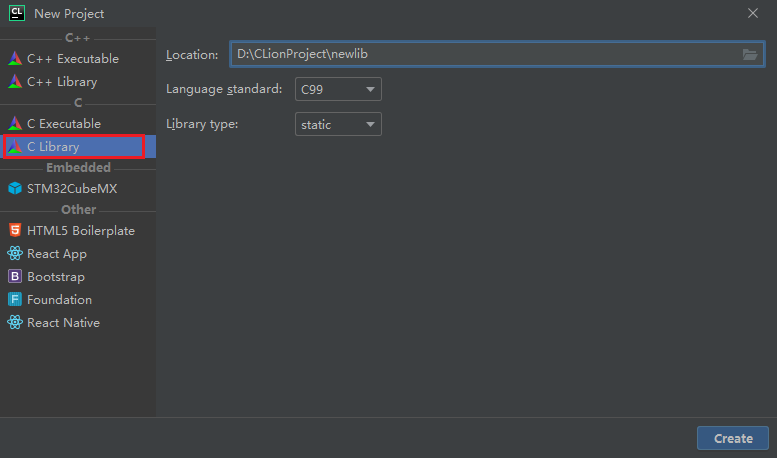

2. 右击__`"library.c"`__源文件或__`“.h”`__头文件，选择：__“重构”__——__“重命名”__。对其进行命名：

   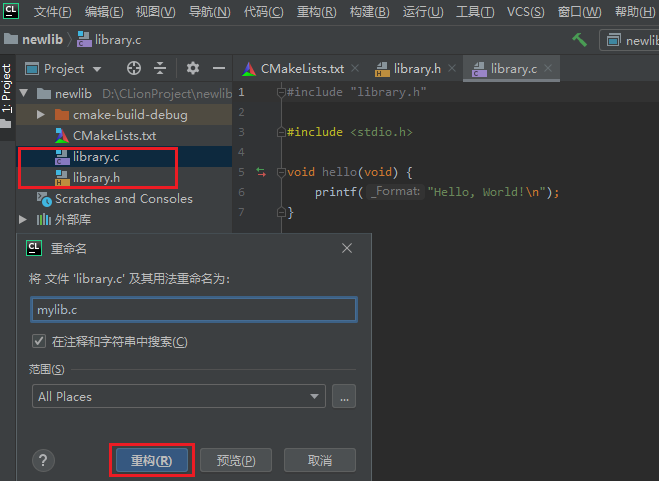

3. 检查__`"CMakeLists"`__,并开__`始构建项目`__：

   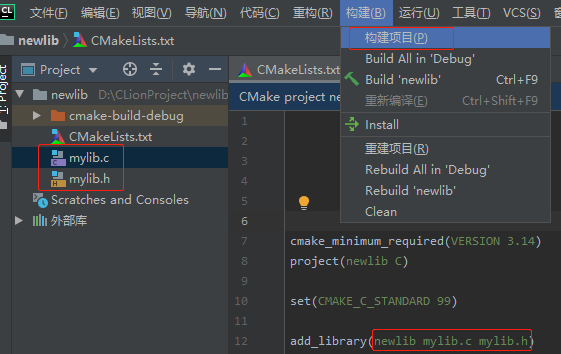

4. 出现了__`"lib+项目名.a"`__文件，则表示创建库文件成功：

   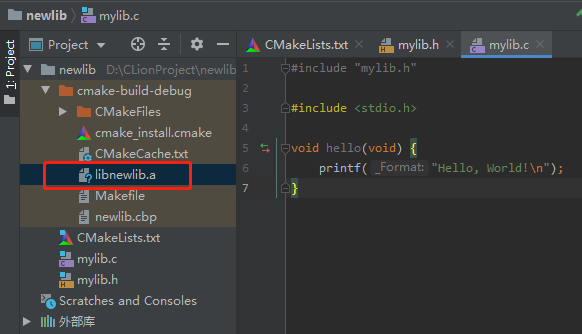

## 引用静态\动态库

1. 打开新的IDE，并创建新的__项目文件__：

   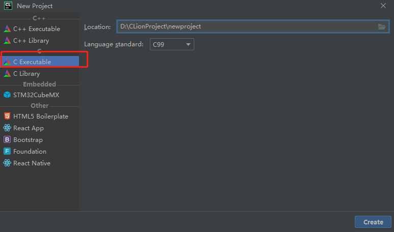

2. 在该项目文件夹下，新建一个__`“lib”`__目录，用于存放自定义的__`“.a”`__库文件：

   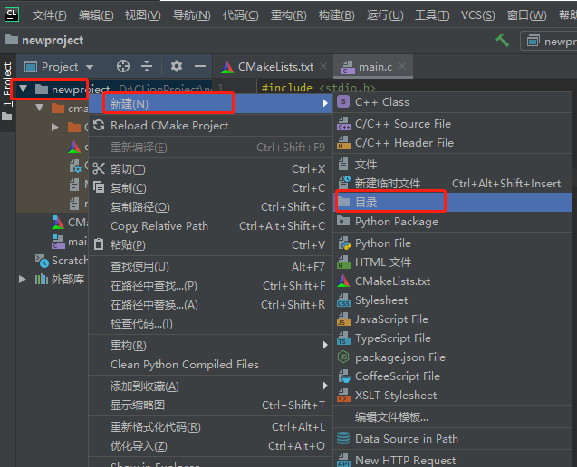

3. 将刚刚创建的.a库文件，拷贝至该目录下：

   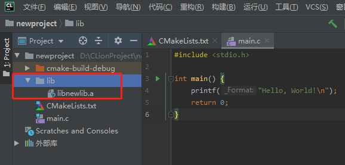

4. 配置__`"CMakeLists.txt"`__，进行库目录和库文件的链接：

   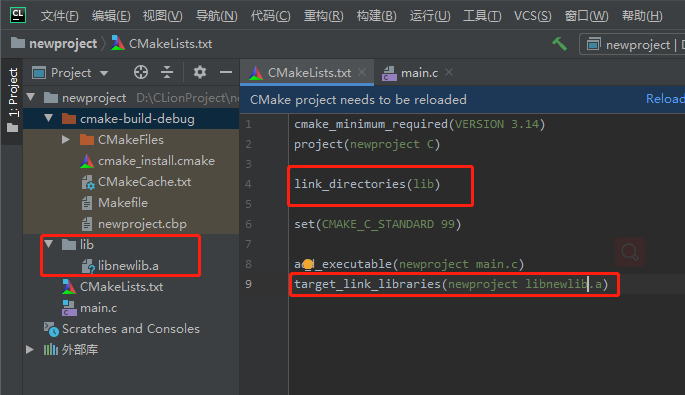

5. 进行__`CMake操作`__：

   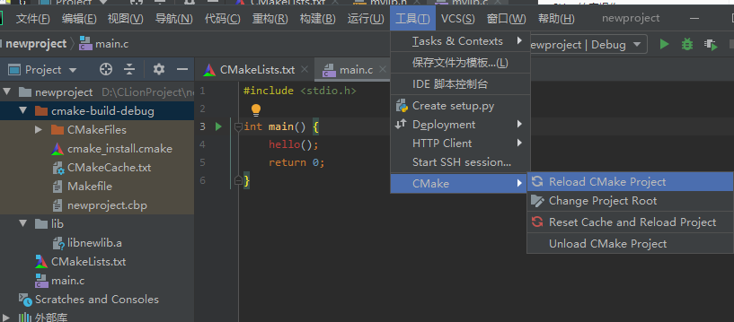

6. 现在，可以开始尝试调用自定义的库中的函数至.c源文件中了：

   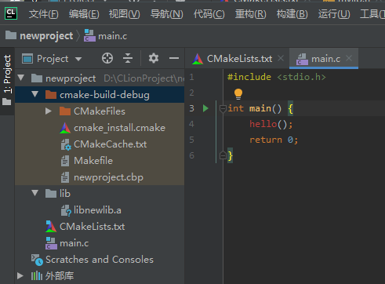

7. 执行一下，发现成功调用并产生了__`.exe`__可执行文件：

   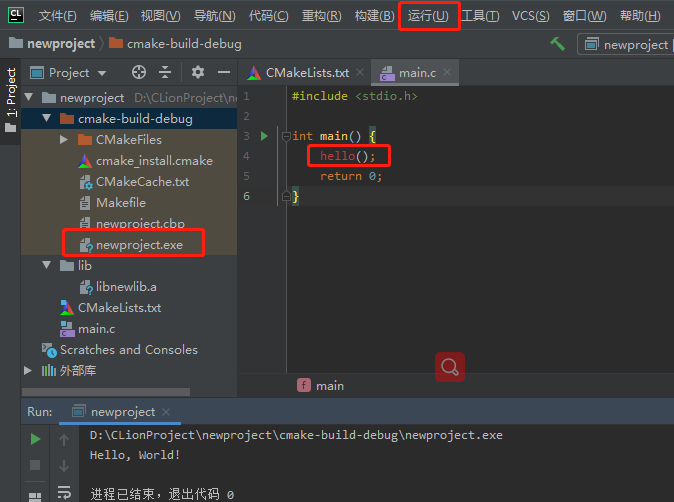

# 外部第三方库操作

这里将以第三方库文件[__`“cJSON”`__](./tool/cJSON)为例，对已知的头文件和源文件进行库的创建，并最终引用，以实现第三方库的引用操作。

​	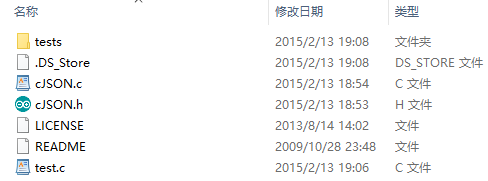

## 创建外部库

1. 与本地库操作相同，创建库项目，并将cJSON内的[头文件](./tool/cJSON/cJSON.h)和[源文件](./tool/cJSON/cJSON.c)拷贝至该项目目录下。需要注意的是，对头文件的__声明部分进行更改__：

   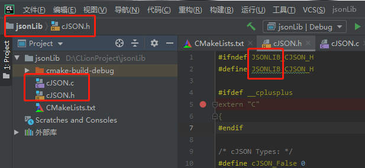

2. 开始构建该项目文件，并开始生成cJSON的“.a”库文件：

   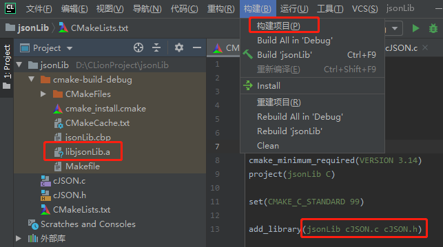

## 引用外部库

1. 与前面引动静态库类似，创建一个项目文件，并相应的创建项目目录，用于存储头文件和库文件：

   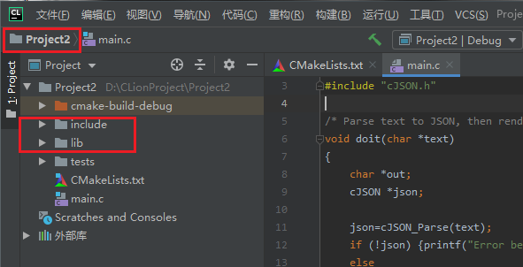

2. 将cJSON的头文件拷贝至__`include`__目录中，并将创建的库文件拷至__`lib`__目录下：

   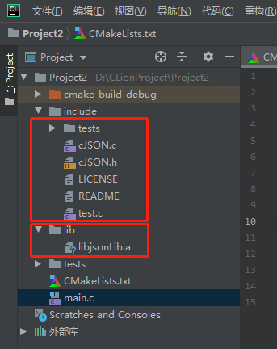

3. 开始对__`CMakeLists`__文件进行配置，并进行__“工具”__——__“CMake”__——__“Reload CMake Project”__操作：

   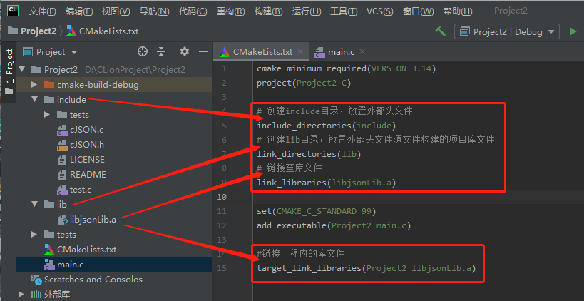

4. 将cJSON内的[__`“test.c”`__](./tool/cJSON/test.c)程序，拷贝至__`"main.c"`__中，并运行该程序，正常可看到程序顺利调用外部库并成功执行，同时生成了__`".exe"`__执行文件：

   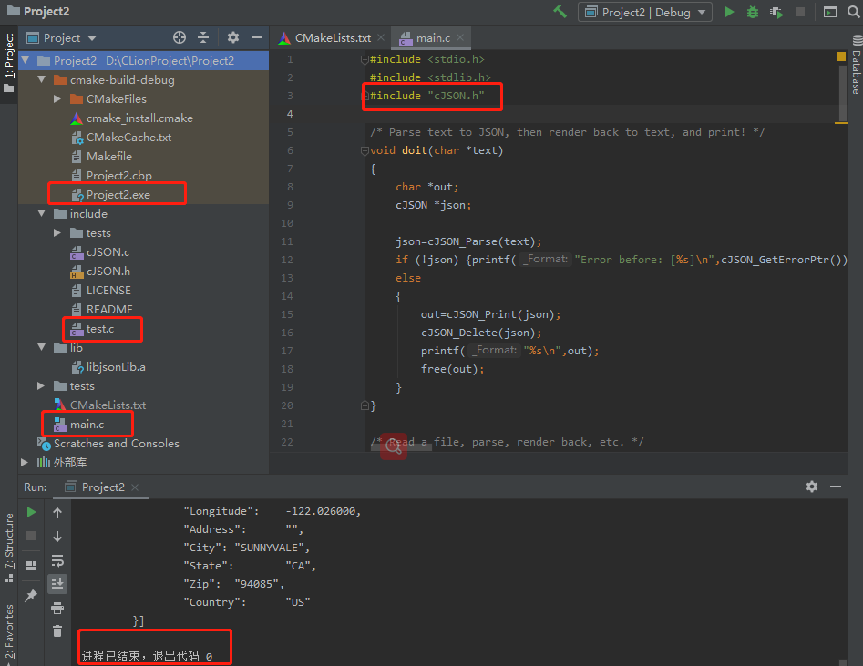

